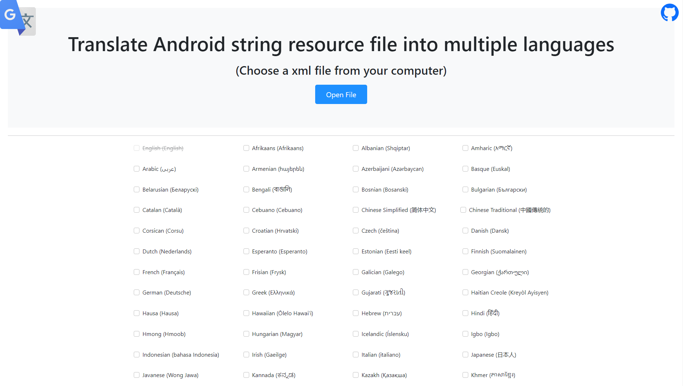

# AndroidTranslateStringResources
Simple site for translating the resource string values in to different languages, using the Google translate function for translating all fields inside a website. You can try it [here](https://slaviboy.github.io/AndroidTranslateStringResources/).
 
<p align="center">
    
</p>
 
## About
My initial idea was to create a server with NodeJS and use the Google API and translate the value, so I build the server and everything worked fine for small number requests. Eventually I tried 100+ sentences at the same time and my IP got blocked by Google, so I was not able to send requests using the Google Translate API. So I came with the idea to use the functionality for translating all the fields of the elements: buttons, div, labels, text,... again using google, but NOT by using the Google Translate API, that way I can have 1000+ senteces with no problem and its is significally faster. 


## How
To use google translate for websites you need to run the site on a server you can use [Visual Studio Code](https://code.visualstudio.com/) and download the extension "Live Server", that way you can start the server with one click.

Here is example using the **Visual Studio Code**
1. Download Visual Studio Code
2. Using 'Visual Studio Code' open the destination folder of the project File-> Open Folder
3. Run the site using the 'Live Server' extension
4. Press the 'Open File' buttons and choose your xml file
5. Choose language
6. Press the 'Download' button and wait for the files to finish generating

The xml file should have the following pattern:
```xml
<resources>
    <string name="name">Hello my name is Stan!</string>
    <string name="quote">Use your imagination to produce creative work and solve problems.</string>
</resources>
```
***If you don`t want to run the project on your own server you can try it [here](https://slaviboy.github.io/AndroidTranslateStringResources/).***

## Problem
If you have problem converting your file, this is usually caused by slow internet connection or sometimes the Google servers are too busy. When that happens you can try refreshing the page and try again (this fixes it 99% of the time). If that does not work you can increase the interval through which the fields are translated by google. Go to the **./js/main.js** file and increase the **interval** property value (first property).
